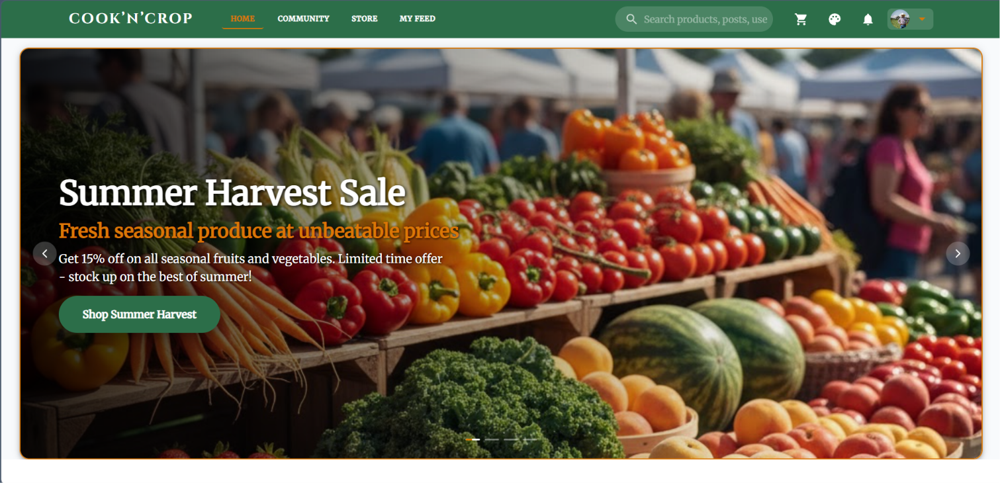
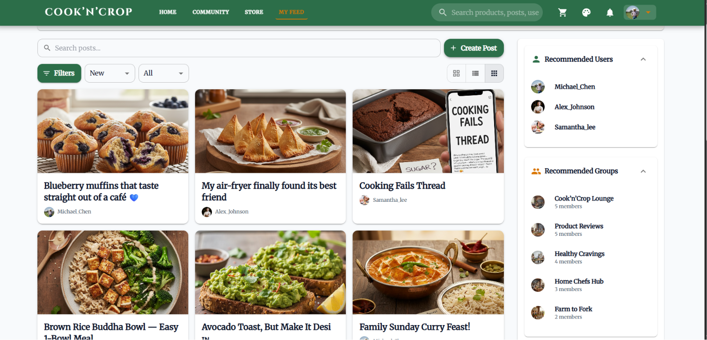
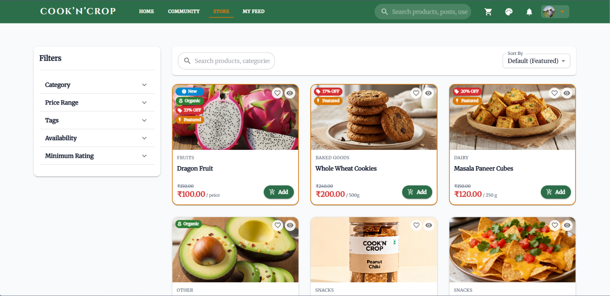
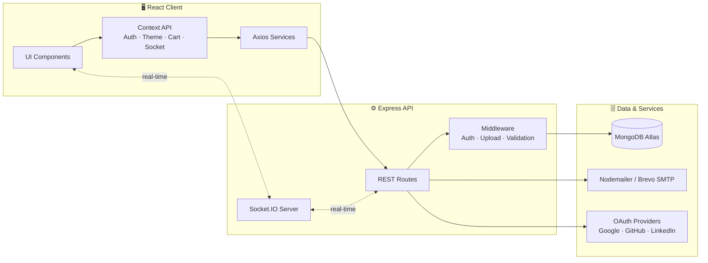

<div align="center">


<br/>

# 🌾 Cook'N'Crop 🍽️

### *Where Culinary Passion Meets the Farm*

**A full-stack social commerce platform connecting food lovers, home chefs, and organic farmers — in one seamless experience.**

<br/>

[](https://nodejs.org/)
[](https://reactjs.org/)
[](https://www.mongodb.com/)
[](https://expressjs.com/)
[](https://socket.io/)

[](https://mui.com/)
[](https://jwt.io/)
[](LICENSE)
[](CONTRIBUTING.md)
[](#)


<br/><br/>

**[📖 About](#-about-the-project) · [✨ Features](#-key-features) · [🎨 Themes](#-curated-design-system) · [🏗️ Architecture](#️-system-architecture) · [🛠️ Tech Stack](#️-technology-stack) · [⚡ Quick Start](#-getting-started) · [📑 API](#-api-reference) · [📂 Structure](#-project-structure) · [🗺️ Roadmap](#️-roadmap) · [🤝 Contributing](#-contributing)**

</div>

<br/>

---

## 📖 About The Project

**Cook'N'Crop** is a modern web platform that unifies three pillars of the food ecosystem into one cohesive product — so a single account carries a user from *"what should I cook?"* all the way to *"it's in my cart and on its way."*

<table>
<tr>
<th width="120" align="center">Pillar</th>
<th>What It Does</th>
</tr>
<tr>
<td align="center">👨‍🍳<br/><b>Community</b></td>
<td>Share structured recipes, join interest-based groups, upvote content, and shop ingredients directly from any post via <b>One-Click Shoppable Recipes</b>.</td>
</tr>
<tr>
<td align="center">🛒<br/><b>Marketplace</b></td>
<td>A full e-commerce storefront (<i>Crop Corner</i>) for fresh, organic produce — with inventory tracking, coupons, saved addresses, and instant checkout.</td>
</tr>
<tr>
<td align="center">🪙<br/><b>Rewards</b></td>
<td>A tiered loyalty system (<b>Bronze → Silver → Gold</b>) that rewards users with <b>Harvest Coins</b> for purchases, engagement, and community contributions.</td>
</tr>
</table>

> 💡 Whether someone wants to discover a new recipe, buy the ingredients for it in two clicks, or chat with a local farmer — Cook'N'Crop brings it all under one roof.

<br/>

<div align="center">

| Home | Recipe Feed | Marketplace |
|:---:|:---:|:---:|
|  |  |  |

</div>

---

## ✨ Key Features

<table>
<tr>
<td valign="top" width="50%">

### 👤 Authentication & Security
- 🔐 **Multi-Provider Auth** — Local JWT login plus OAuth 2.0 via Google, GitHub, and LinkedIn
- 🛡️ **Hardened by Design** — Bcrypt hashing, HTTP-only cookies, JWT session tracking
- 📧 **Account Recovery** — Email-verified password reset flows
- 🎚️ **RBAC** — Granular permissions across Users, Moderators, and Admins

### 🛒 Crop Corner Marketplace
- 🔍 **Smart Discovery** — Live multi-field search, category filters, stock indicators, rating badges
- 🧾 **Shoppable Recipes** — Add every ingredient from a recipe post to your cart in one click
- 💳 **Seamless Checkout** — Persistent carts, coupons, saved addresses, COD / online payments
- 📦 **Order Tracking** — Real-time status updates and itemized order history

</td>
<td valign="top" width="50%">

### 📝 Community & Messaging
- ✍️ **Rich Recipe Builder** — Prep times, ingredients, step-by-step instructions, tags, media
- 💬 **Threaded Discussions** — Nested comments, upvotes, saved collections, bookmarking
- ⚡ **Real-Time Messenger** — Socket.IO chat with presence indicators and unread badges
- 👥 **Community Groups** — Interest-based groups with moderator tools & auto-join

### 🛠️ Administrator Suite
- 📊 **Analytics Dashboard** — Financial metrics, low-stock alerts, recent order feeds
- 🧑‍💼 **User & Order Management** — Full CRUD over roles, statuses, and order lifecycles
- 📢 **Broadcast Announcements** — Platform-wide notifications from the admin panel
- 🏷️ **Coupons & Bulk Inventory** — Discount codes plus CSV-based product imports

</td>
</tr>
</table>

---

## 🎨 Curated Design System

Cook'N'Crop ships with **10 hand-crafted, glare-free themes** (5 light · 5 dark) built for a visually rich, eye-friendly experience — every theme includes full MUI component overrides, curated Google Fonts (`Outfit`, `Inter`, `Playfair Display`, `Roboto Mono`), subtle micro-animations, and live color-swatch previews.

| Theme | Mode | Palette |
|---|:---:|---|
| 🌾 **Harvest Luxe** *(default)* | ☀️ Light | Sage green `#2c6e49` · Warm amber `#d97706` |
| 🌙 **Harvest Luxe Dark** *(default)* | 🌑 Dark | Deep emerald `#38764e` · Honey amber `#c68a32` |
| 👑 **Royal Amethyst** | 🌑 Dark | Deep regal purple tones |
| 👑 **Royal Amethyst Light** | ☀️ Light | Soft lavender & plum accents |
| 🌊 **Abyssal Teal** | 🌑 Dark | Crisp deep teal |
| ❄️ **Nordic Mist** | ☀️ Light | Cool, airy teal counterpart |
| 🌅 **Sunset Glow** | ☀️ Light | Warm coral sunbursts |
| ☕ **Espresso Dark** | 🌑 Dark | Rich, dark roast hues |

<div align="center">

`#2c6e49` `#d97706` `#38764e` `#c68a32` `#7c3aed` `#0f766e` `#f97316` `#4a2c2a`

</div>

---

## 🏗️ System Architecture



---

## 🛠️ Technology Stack

<table>
<tr>
<td valign="top" width="50%">

**Frontend**
- React 18 + React Router v6
- Material-UI (MUI v5)
- Styled-Components
- Context API — Auth, Theme, Cart, Socket
- Axios

**Real-Time**
- Socket.IO Client

</td>
<td valign="top" width="50%">

**Backend**
- Node.js + Express.js
- Mongoose ODM
- MongoDB / MongoDB Atlas

**Auth & Security**
- Passport.js · JWT · Bcrypt.js · CORS

**Comms & Tooling**
- Nodemailer (SMTP / Brevo)
- Concurrently · ESLint · Prettier · PostCSS

</td>
</tr>
</table>

---

## ⚡ Getting Started

### Prerequisites

| Requirement | Version |
|---|---|
| Node.js | v16.x or higher |
| npm | v8.x or higher |
| MongoDB | Local instance or Atlas cluster |

### 1️⃣ Clone the Repository

```bash
git clone https://github.com/your-username/COOK-N-CROP.git
cd COOK-N-CROP
```

### 2️⃣ Configure Environment Variables

Create a `.env` file inside **`server/`**:

```env
NODE_ENV=development
PORT=5000
MONGO_URI=mongodb+srv://<username>:<password>@cluster.mongodb.net/cookncrop?retryWrites=true&w=majority
JWT_SECRET=your_super_secret_jwt_key
JWT_EXPIRE=7d
SESSION_SECRET=your_session_secret
CLIENT_URL=http://localhost:3000

# Optional Email SMTP (Brevo / Nodemailer)
EMAIL_HOST=smtp-relay.brevo.com
EMAIL_PORT=587
EMAIL_USER=your_email@example.com
EMAIL_PASS=your_smtp_key
FROM_EMAIL=noreply@cookncrop.com
FROM_NAME=Cook'N'Crop
```

Create a `.env` file inside **`client/`**:

```env
REACT_APP_API_URL=http://localhost:5000
```

<details>
<summary>📋 <b>Environment variable reference</b></summary>

| Variable | Location | Required | Description |
|---|:---:|:---:|---|
| `MONGO_URI` | server | ✅ | MongoDB Atlas / local connection string |
| `JWT_SECRET` | server | ✅ | Secret used to sign JWTs |
| `JWT_EXPIRE` | server | ✅ | JWT expiry window (e.g. `7d`) |
| `SESSION_SECRET` | server | ✅ | Session/cookie signing secret |
| `CLIENT_URL` | server | ✅ | Allowed CORS origin for the frontend |
| `EMAIL_HOST` / `EMAIL_PORT` | server | ➖ | SMTP host & port for transactional email |
| `EMAIL_USER` / `EMAIL_PASS` | server | ➖ | SMTP credentials |
| `FROM_EMAIL` / `FROM_NAME` | server | ➖ | Sender identity for outgoing email |
| `REACT_APP_API_URL` | client | ✅ | Base URL the client uses to reach the API |

</details>

### 3️⃣ Install & Run

```bash
# Install dependencies for root, client, and server
npm install
npm run install-all

# Launch client (3000) + server (5000) concurrently
npm run dev
```

| Service | URL |
|---|---|
| 🖥️ Frontend App | `http://localhost:3000` |
| 🔌 Backend API | `http://localhost:5000` |

<details>
<summary>🧰 <b>Useful root scripts</b></summary>

| Script | Description |
|---|---|
| `npm run dev` | Runs client & server concurrently in dev mode |
| `npm run install-all` | Installs dependencies across root, client, and server |
| `npm run client` | Runs only the React frontend |
| `npm run server` | Runs only the Express backend |
| `npm run build` | Builds the production-ready client bundle |

</details>

---

## 📑 API Reference

<details>
<summary><b>🔐 Authentication</b></summary>
<br/>

| Method | Endpoint | Description | Access |
|:---:|---|---|:---:|
| `POST` | `/api/auth/register` | Register a new user | Public |
| `POST` | `/api/auth/login` | Authenticate & receive JWT | Public |
| `POST` | `/api/auth/forgot-password` | Trigger password reset email | Public |
| `POST` | `/api/auth/reset-password/:token` | Reset password via emailed token | Public |

</details>

<details>
<summary><b>📝 Posts & Community</b></summary>
<br/>

| Method | Endpoint | Description | Access |
|:---:|---|---|:---:|
| `GET` | `/api/posts` | Fetch paginated feed & community posts | Optional Auth |
| `GET` | `/api/posts/most-liked` | Fetch top-voted posts & recipes | Public |
| `POST` | `/api/posts` | Create a new recipe/discussion post | Private |
| `POST` | `/api/posts/:id/comments` | Add a comment to a post | Private |
| `POST` | `/api/posts/:id/upvote` | Upvote a post | Private |

</details>

<details>
<summary><b>🛒 Marketplace & Orders</b></summary>
<br/>

| Method | Endpoint | Description | Access |
|:---:|---|---|:---:|
| `GET` | `/api/products` | Browse Crop Corner catalog | Public |
| `GET` | `/api/cart` | Get current user's shopping cart | Private |
| `POST` | `/api/cart` | Add an item to the cart | Private |
| `POST` | `/api/orders` | Place a new order | Private |
| `GET` | `/api/orders/myorders` | Get logged-in user's order history | Private |

</details>

<details>
<summary><b>👤 Users & Admin</b></summary>
<br/>

| Method | Endpoint | Description | Access |
|:---:|---|---|:---:|
| `GET` | `/api/users/me` | Fetch active user profile | Private |
| `PUT` | `/api/users/me` | Update profile details | Private |
| `GET` | `/api/orders` | Admin order management list | Admin Only |
| `PUT` | `/api/users/:id/role` | Update a user's role | Admin Only |

</details>

---

## 📂 Project Structure

```
COOK-N-CROP/
├── client/                     # Frontend React Application
│   ├── public/                 # Static assets & placeholders
│   └── src/
│       ├── components/         # Reusable UI components (Navbar, PostCard, Cart)
│       ├── contexts/           # React Contexts (Auth, Theme, Cart, Socket)
│       ├── custom_components/  # Specialized animations & loaders
│       ├── pages/              # Main view pages & Admin sub-pages
│       ├── services/           # Axios API wrappers
│       ├── utils/              # Image resolution & helper utilities
│       ├── App.js              # Application entry layout
│       ├── router.js           # Declarative React Router setup
│       └── themeUtils.js       # Curated 10-theme color palette generator
│
├── server/                     # Backend Node/Express API
│   ├── config/                 # Database connection setup
│   ├── middleware/              # Auth, upload, and validation middleware
│   ├── models/                 # Mongoose schemas (User, Post, Order, Product)
│   ├── routes/                 # Express API routes
│   └── server.js               # Main HTTP & Socket.IO server initialization
│
├── package.json                # Root concurrent scripts
└── README.md                   # Project documentation
```

---

## 🗺️ Roadmap

- [ ] 📱 Native mobile app (React Native)
- [ ] 🌐 Multi-language support (i18n)
- [ ] 🚚 Live delivery tracking with map integration
- [ ] 🤖 AI-powered recipe recommendations
- [ ] 📈 Advanced seller analytics for farmers
- [ ] 🧾 Digital receipts & tax exports for farmer accounts

See the [open issues](../../issues) for a full list of proposed features and known issues.

---

## ❓ FAQ

<details>
<summary><b>Can I use my own MongoDB instance instead of Atlas?</b></summary>
<br/>
Yes — just point <code>MONGO_URI</code> in <code>server/.env</code> to any standard MongoDB connection string, local or hosted.
</details>

<details>
<summary><b>Is email/SMTP configuration mandatory?</b></summary>
<br/>
No, the <code>EMAIL_*</code> variables are optional. Without them, password-reset emails simply won't be sent — everything else works normally.
</details>

<details>
<summary><b>Which OAuth providers are supported out of the box?</b></summary>
<br/>
Google, GitHub, and LinkedIn, via Passport.js strategies alongside local JWT authentication.
</details>

---

## 🤝 Contributing

Contributions make the open-source community amazing — any contributions are **greatly appreciated**.

1. Fork the project
2. Create your feature branch: `git checkout -b feature/AmazingFeature`
3. Commit your changes: `git commit -m 'Add some AmazingFeature'`
4. Push to the branch: `git push origin feature/AmazingFeature`
5. Open a Pull Request

Please make sure to update tests as appropriate and follow the existing code style (ESLint + Prettier configs are included).

---

<div align="center">

### 🌱 Connect. Cook. Crop. 🍽️

**Built with ❤️ by the Cook'N'Crop Team**

⭐ *If you like this project, consider giving it a star — it helps a lot!* ⭐

<br/>

</div>